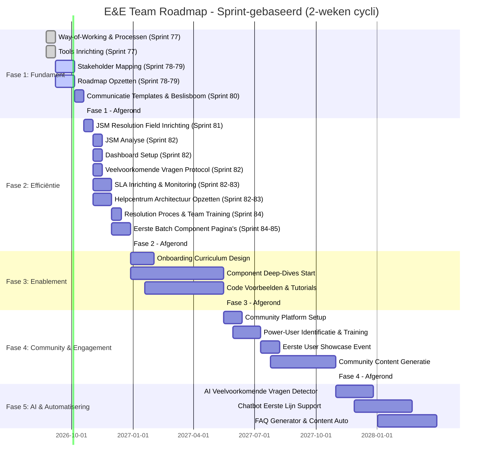
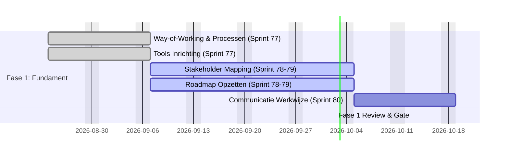
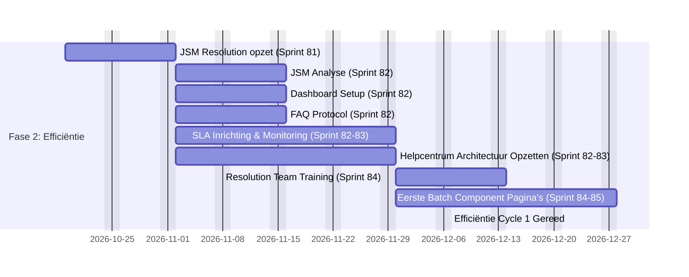
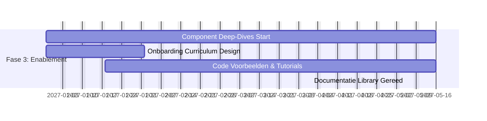
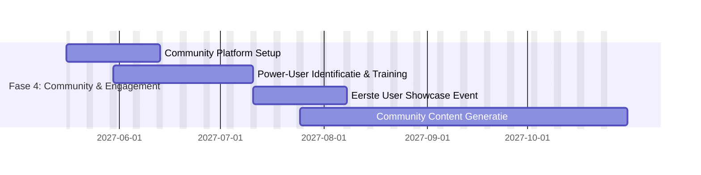
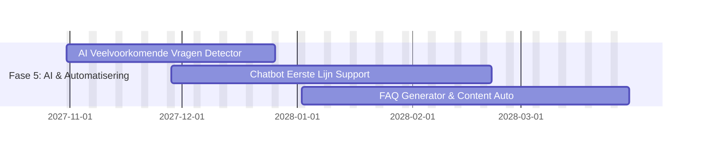

---
hide:
  - toc
---
# Enablement & Engagement Team - Roadmap 2026

*6-12 maanden planning voor het E&E Team van het Data Science Platform*

---

## Tijdlijn Overzicht - 2-wekelijkse Sprints

---

## Fase 1: Fundament (Augustus - Oktober 2026)

**Doel:** Team gereed, stakeholders aligned, communicatie helder, roadmap vastgesteld

**Duur:** 4 sprints (8 weken)

### Sprint 77 (24 Aug - 7 Sep 2026)

**Status:** Afgerond

| Taak | Verantwoordelijke | Output |
|------|------------------|--------|
| **Way-of-Working & Processen** | Team Lead (jij) | Gedocumenteerd: Besluitvorming, communicatie, sprint rhythm, escalatie proces, decision logs |
| **Team Rollen & Verantwoordelijkheden** | Team Lead (jij) | Duidelijke rollen per teamlid: wat je doet, wanneer je input hebt, wanneer je beslist |
| **Tools Inrichting** | Medior DevOps Engineer (begeleiding Team Lead) | Wiki ruimte opgezet, Jira project geconfigureerd (sprints, workflows, custom fields), Mattermost kanalen ingesteld |

---

### Sprint 78 (7 Sep - 21 Sep 2026)

**Status:** Afgerond

**Focus: Stakeholder Mapping & Roadmap Opzetten**

| Taak | Verantwoordelijke | Output |
|------|------------------|--------|
| **Stakeholder Mapping & Alignment** | Team Lead (jij) | Overzicht van alle DSP stakeholders, contactpersonen, engagement plan, verwachtingen uitgelegd |
| **Roadmap Opzetten** | Team Lead (jij) | Dit document uitgewerkt en in Wiki opgeslagen, met alle sprints, milestones, deliverables en afhankelijkheden |

**Deliverable:** Stakeholder matrix aangemaakt, eerste versie roadmap beschikbaar

---

### Sprint 79 (21 Sep - 5 Okt 2026)

**Status:** Lopend

**Focus: Stakeholder Mapping & Roadmap Opzetten (Vervolg)**

| Taak | Verantwoordelijke | Output |
|------|------------------|--------|
| **Stakeholder Mapping Verdieping** | Team Lead (jij) | Aanvullende gesprekken, alignment finaliseren |
| **Roadmap Finalisering** | Team Lead (jij) | Roadmap final review, sign-off stakeholders |
| **Helpcentrum SSP2.0** | Functioneel Beheer | Helpcentrum documentatie moet geupdate worden met SSP2.0 look-and-feel |

**Deliverable:** Stakeholder mapping & definitieve roadmap goedgekeurd

**Milestone (5 Okt):** Stakeholder mapping & roadmap voor de volgende fase

---

### Sprint 80 (5 Okt - 19 Okt 2026)

**Status:** Niet gestart

**Focus: Communicatie Templates & Beslisboom**

| Taak | Verantwoordelijke | Output |
|------|---|--------|
| **Communicatie Templates Ontwerpen** | Team Lead (jij) + Functioneel Beheerder | Templates voor support responses richting klanten (standaard issues, escalaties, follow-ups) |
| **Beslisboom Ontwikkelen** | Team Lead (jij) | Beslisboom voor wie communiceert als E&E team niet beschikbaar is (out-of-office protocol), escalatie paths |
| **Templates Testing** | Functioneel Beheerder | Doorloop scenarios: pas templates toe, feedback geven, optimalisaties |
| **Team Training Communicatie** | Team Lead (jij) | Training: wanneer welke template gebruiken? Personalisatie? Escalatie criteria? |
| **Templates & Beslisboom Live** | Team Lead (jij) | Opgeslagen in Wiki, toegankelijk voor het team, dagelijks bruikbaar |

**Deliverable:** Communicatie templates & beslisboom complete en team is op de hoogte

**Milestone (19 Okt):** Fase 1 Gate - Fundament

---

## Fase 2: Efficiëntie (Oktober - December 2026)

**Doel:** Eerste grote slag in efficiëntie - support vragen voorkomen via documentatie, SLA's implementeren, veelvoorkomende vragen structureel aanpakken

**Duur:** 9 sprints (18 weken)

### Sprint 81 (19 Okt - 2 Nov 2026)

**Status:** Niet gestart

**Focus: JSM Resolution Field Setup**

| Taak | Verantwoordelijke | Output |
|------|------------------|--------|
| **JSM Resolution Field Definiëren** | Team Lead (jij) + Medior DevOps Engineer | Bepaal: wat zijn geldige resolution types? (Opgelost, Duplicate, Kan Niet Reproduceren, Wacht op Klant, etc.) |
| **JSM Workflow Configuration** | Medior DevOps Engineer | JSM: Resolution field integreren in workflow, automatische transities configureren (bijv. resolution → ticket close) |
| **Team Training Resolution** | Team Lead (jij) + Functioneel Beheerder | Training: hoe voer je Resolution in? Wat zijn geldige redenen? Wanneer mag je ticket afsluiten? Best practices |
| **JSM Data Extractie Start** | Medior DevOps Engineer + Team Lead | Start analyse van laatste 100-150 tickets: typen, componenten, categorieën, tijden, patronen, bottlenecks |

**Deliverable:** JSM Resolution field live en team trained, data extractie opgestart

---

### Sprint 82 (2 Nov - 16 Nov 2026)

**Status:** Niet gestart

**Focus: JSM Analyse, Dashboards, SLA's & Protocol**

| Taak | Verantwoordelijke | Output |
|------|------------------|--------|
| **JSM Data Analyse** | Medior DevOps Engineer + Team Lead | Analyse van tickets compleet: patronen en bottlenecks geïdentificeerd |
| **Dashboard Opzetten - Overzicht** | Medior DevOps Engineer | JSM Dashboard 1: Team performance (tickets in/out, gemiddelde tijd per status, SLA status overview) |
| **Dashboard Opzetten - Patroondetectie** | Medior DevOps Engineer | JSM Dashboard 2: Veelvoorkomende vragen (top categories, top components, trending issues) |
| **Dashboard Opzetten - Inzicht** | Medior DevOps Engineer | JSM Dashboard 3: Kwaliteit metrics (resolution rate, re-opened tickets, first contact resolution %, resolution time) |
| **SLA Strategie & Inrichting** | Team Lead (jij) + Functioneel Beheerder | SLA's bepaald per ticket type (vb. bugs: 24u, features: 5 werkdagen), JSM SLA rules opstarten |
| **Veelvoorkomende Vragen Protocol** | Team Lead (jij) + Functioneel Beheerder | Protocol: hoe identificeren we veelvoorkomende vragen? Wie is verantwoordelijk? Wanneer maken we extra documentatie? Hoe vaak doen we de check op veelvoorkomende vragen? |

**Deliverable:** 3 dashboards operational, SLA strategie vastgesteld, protocol defined

---

### Sprint 83 (16 Nov - 30 Nov 2026)

**Status:** Niet gestart

**Focus: SLA Monitoring, Helpcentrum Architectuur & Response Templates**

| Taak | Verantwoordelijke | Output |
|------|------------------|--------|
| **SLA Monitoring Setup** | Medior DevOps Engineer | Dashboard voor SLA status, alerts voor approaching/breached SLA's, weekly SLA report template |
| **SLA Rules Finalise** | Team Lead (jij) + Functioneel Beheerder | Alle SLA types geconfigureerd in JSM, thresholds ingesteld, monitoring active |
| **Helpcentrum Architectuur Ontwerpen** | Team Lead (jij) + Functioneel Beheerder | Structuur: Homepage met platform overview, per component eigen pagina met standaard format (functionele beschrijving, technische beschrijving, code examples, FAQ's, troubleshooting) |
| **Homepage Uitwerken** | Team Lead (jij) | Helpcentrum homepage: wat is DSP? Quick start, component overzicht, how to request components, contact E&E team |
| **Component Pagina Template** | Functioneel Beheerder + Medior DevOps Engineer | Template pagina per component: altijd dezelfde structuur, uniform look & feel, easy navigation |
| **JSM Response Templates Ontwerp** | Functioneel Beheerder | JSM: draft auto-reply templates met links naar relevante helpcentrum pagina's, per ticket category |

**Deliverable:** SLA monitoring live, Helpcentrum architectuur vastgesteld, Response templates drafted

---

### Sprint 84 (30 Nov - 14 Dec 2026)

**Status:** Niet gestart

**Focus: Resolution Proces Operationeel & Component Pagina's Start**

| Taak | Verantwoordelijke | Output |
|------|------------------|--------|
| **Resolution Proces Optimaliseren** | Team Lead (jij) + Functioneel Beheerder | Duidelijk proces: hoe markeer je ticket als opgelost? Communicatie naar klant? Customer confirmation? Afsluiting in JSM? |
| **JSM Automation voor Resolution** | Medior DevOps Engineer | Automation rules: ticket met resolution field → auto-notificatie naar klant → customer confirmation workflow → auto-close na X dagen |
| **Team Practicum & Optimalisatie** | Team Lead (jij) + Functioneel Beheerder | Gesimuleerde tickets doorlopen: team voelt Resolution proces, geeft feedback, optimalisaties toepassen |
| **JSM Response Templates Live** | Functioneel Beheerder | JSM: templates live met links naar helpcentrum, per ticket category |
| **Top 5 Veelgestelde Vragen** | Functioneel Beheerder + Team Lead | Baseer op JSM analyse: welke vragen komen het meest voor? Dit bepaalt prioriteit voor eerste batch component pagina's 

**Deliverable:** Resolution proces geautomatiseerd in JSM, Response templates live, eerste 2 component pagina's in progress

---

### Sprint 85 (14 Dec - 28 Dec 2026)

**Status:** Niet gestart

**Focus: Eerste Batch Component Pagina's**

| Taak | Verantwoordelijke | Output |
|------|------------------|--------|
| **Component Pagina 1: Database** | Medior DevOps Engineer + Functioneel Beheerder | Volledige pagina: functionele beschrijving, technische beschrijving, setup guide, code examples (Python/SQL), FAQ's, troubleshooting |
| **Component Pagina 2: S3** | Medior DevOps Engineer + Functioneel Beheerder | Volledige pagina: dezelfde structuur als Database |
| **Component Pagina 3: OpenSearch** | Medior DevOps Engineer + Functioneel Beheerder | Volledige pagina: dezelfde structuur |
| **Veelvoorkomende Vragen Monitoren** | Functioneel Beheerder + Team Lead | Wekelijkse review: zijn veelgestelde vragen gedaald dankzij documentatie? Welke vragen opnieuw? |
| **Proces & Dashboard Review** | Team Lead (jij) | Retrospective: hoe werken SLA's in praktijk? Dashboards nuttig? Resolution proces smooth? Aanpassingen nodig? |
| **Fase 2 Metrics Baseline** | Medior DevOps Engineer | Verzamel baseline metrics: tickets/week, resolution time, SLA compliance %, self-service rate |

**Deliverable:** Eerste 3 component pagina's live in helpcentrum, JSM templates actief, Resolution proces validated

**Milestone (28 Dec):** Fase 2 Gate - Efficiëntie cycle 1. Support ticket volume significant lager, self-service route effectief, JSM Resolution & SLA's established

---

## Fase 3: Enablement (December 2026 - Mei 2027)

**Doel:** Volledige enablement via component deep-dives, onboarding curriculum, code voorbeelden

**Duur:** 19 sprints (38 weken)

### Sprint 86-87 (28 Dec 2026 - 25 Jan 2027)

**Status:** Niet gestart

**Focus: Begin Onboarding Curriculum Design & Component Deep-Dives Start**

| Taak | Verantwoordelijke | Output |
|------|------------------|--------|
| **Definieer "Nieuwe Gebruiker Journey"** | Functioneel Beheerder | Stap-voor-stap: registratie → eerste project → eerste component aanvraag → succes |
| **Curriculum Structuur** | Team Lead (jij) | Modules: Platform basics, Component overzicht, Aan de slag met X |
| **Leerresultaten** | Team Lead (jij) + Functioneel Beheerder | Wat moeten gebruikers kunnen doen na elke module? |
| **Component 1: Database - Setup Gids** | Medior DevOps Engineer | Stap-voor-stap: aanvragen → provisioning → eerste query |
| **Component 1: Database - Architectuur** | Medior DevOps Engineer | Wat is het? Hoe past het in DSP? Limitaties? |

**Output:** Onboarding curriculum outline vastgesteld, Database component gestart

---

### Sprint 88-89 (25 Jan - 8 Feb 2027)

**Status:** Niet gestart

**Focus: Component Deep-Dives Voortgang**

| Taak | Verantwoordelijke | Output |
|------|------------------|--------|
| **Component 1: Database - Tutorials & Code** | Medior DevOps Engineer + Functioneel Beheerder | 3-5 use cases, code examples (Python/SQL), troubleshooting gids |
| **Component 2: S3 - Setup Gids & Architectuur** | Medior DevOps Engineer | Stap-voor-stap setup, architectuur overzicht |
| **Component 2: S3 - Tutorials & Code** | Medior DevOps Engineer + Functioneel Beheerder | 3-5 use cases, code examples |

**Output:** Database volledig, S3 component in progress

---

### Sprint 90-91 (8 Feb - 22 Feb 2027)

**Status:** Niet gestart

**Focus: Component Deep-Dives Voortgang**

| Taak | Verantwoordelijke | Output |
|------|------------------|--------|
| **Component 2: S3** | Medior DevOps Engineer + Functioneel Beheerder | Volledige documentatie met troubleshooting |
| **Component 3: OpenSearch - Setup tot Code** | Medior DevOps Engineer + Functioneel Beheerder | Volledige documentatie |

**Output:** S3 volledig, OpenSearch volledig

---

### Sprint 92-93 (22 Feb - 8 Mar 2027)

**Status:** Niet gestart

**Focus: Component Deep-Dives Finale**

| Taak | Verantwoordelijke | Output |
|------|------------------|--------|
| **Component 4: Airflow - Setup tot Code** | Medior DevOps Engineer + Functioneel Beheerder | Volledige documentatie |
| **Code Voorbeelden Review & Organisation** | Medior DevOps Engineer | Code voorbeelden organized en accessible |

**Output:** 4 componenten volledig gedocumenteerd

---

### Sprint 94-98 (8 Mar - 5 Apr 2027)

**Status:** Niet gestart

**Focus: Onboarding Curriculum Live**

| Taak | Verantwoordelijke | Output |
|------|------------------|--------|
| **Bouw Onboarding Learning Path** | Functioneel Beheerder | Gestructureerd pad in helpcentrum: modules, quizzes, progressie |
| **Neem Intro Video's Op** | Medior DevOps Engineer | 3-5 korte video's (5-10 min): platform overzicht, eerste stappen |
| **Finaliseer Voorbeelden & Code Repo** | Medior DevOps Engineer | GitHub repo met alle code voorbeelden (georganiseerd per component) |
| **Kwaliteits Review** | Team Lead (jij) | Test: kan een NIEUWE gebruiker curriculum succesvol volgen? |

**Deliverable:** Volledige onboarding curriculum live & bruikbaar

**Milestone (16 May):** Fase 3 Gate - Documentatie library en self-service pad vastgesteld

---

## Fase 4: Community & Engagement (Mei 2027 - Oktober 2027)

**Doel:** Community platform live, power-users geactiveerd, community-gegenereerde inhoud

**Duur:** 24 sprints (48 weken)

### Sprint 99-100 (16 May - 13 Jun 2027)

**Status:** Niet gestart

**Focus: Community Platform Setup**

| Taak | Verantwoordelijke | Output |
|------|------------------|--------|
| **Selecteer Platform** | Medior DevOps Engineer + Team Lead | Slack/Teams/Discord keuze + setup |
| **Definieer Community Richtlijnen** | Team Lead (jij) | Regels: wat is on-topic, escalatie proces, moderatie beleid |
| **Structureer Community Kanalen** | Functioneel Beheerder | Kanalen: #algemeen, #database, #s3, #airflow, #opensearch, #troubleshooting, #showcases |
| **Welcome Automatisering** | Medior DevOps Engineer | Auto-welcome bot met resources & richtlijnen |
| **Soft Launch** | Team Lead (jij) | Nodig 10-15 vriendelijke power-users voor feedback uit |

**Output:** Community platform voor lancering

---

### Sprint 101-104 (13 Jun - 11 Jul 2027)

**Status:** Niet gestart

**Focus: Power-User Identificatie & Training**

| Taak | Verantwoordelijke | Output |
|------|------------------|--------|
| **Identificeer Power-Users** | Functioneel Beheerder + Team Lead | Analyseer: wie stelt slimme vragen? Wie helpt anderen? 1-2 per component |
| **Outreach & Wervingsgesprekken** | Team Lead (jij) | Persoonlijke vragen: "We zien dat je Database expert bent, wil je ambassador worden?" |
| **Power-User Programma Design** | Team Lead (jij) | Rol definitie, verantwoordelijkheden, voordelen (early access, special badge, merchandise?) |
| **Training Power-Users** | Team Lead (jij) + Medior DevOps Engineer | Sessies: community management 101, escalatie proces, content creatie |
| **Geef Hen Macht** | Functioneel Beheerder | Geef: moderator rechten, templates, knowledge base toegang |

**Output:** 4-6 power-users (1 per grote component) trained & geactiveerd

---

### Sprint 105-106 (11 Jul - 8 Aug 2027)

**Status:** Niet gestart

**Focus: Eerste User Showcase Event**

| Taak | Verantwoordelijke | Output |
|------|------------------|--------|
| **Event Planning** | Team Lead (jij) + Functioneel Beheerder | Format: 2-uur webinar of workshop |
| **Wervingen Demo Presentatoren** | Team Lead (jij) | 2-3 klanten bereid om hun use-cases te demonstreren |
| **Voorbereiding Slides & Flow** | Medior DevOps Engineer + Team Lead | Agenda: DSP updates, klant demos, Q&A, netwerken |
| **Promotie** | Functioneel Beheerder | Nodig alle klanten uit, benadruk: "Zie hoe anderen DSP gebruiken" |
| **Voer Event Uit** | Iedereen | Voer de event uit, neem op voor toekomstige referentie |
| **Post-Event Feedback** | Team Lead (jij) | Enquête: wat heb je geleerd? Wat wil je volgende keer zien? |

**Output:** Eerste showcase event uitgevoerd, customer engagement piek, content van demos

---

### Sprint 107-112 (8 Aug - 31 Oct 2027)

**Status:** Niet gestart

**Focus: Community Content Generatie & Momentum**

| Taak | Verantwoordelijke | Output |
|------|------------------|--------|
| **Befähigung Power-Users om Content te Creëren** | Team Lead (jij) + Functioneel Beheerder | Templates & proces: hoe schrijf je een use-case post? Code snippet? Tip? |
| **Curateer Community Bijdragen** | Functioneel Beheerder | Feature beste posts, code voorbeelden, tips in wekelijkse digest |
| **Maandelijkse Community Highlights** | Team Lead (jij) | Digest: top vragen gesteld, beste antwoorden, nieuwe features, aankomende events |
| **Feedback Loop naar Product** | Team Lead (jij) | Synthesiseer community verzoeken → maandelijkse briefing naar DSP Product Owner |
| **Metrics & Gezondheidscheck** | Medior DevOps Engineer | Dashboard: community posts/week, deelnamepercentage, sentiment, support ticket % daling |

**Output:** Zelf-ondersteunende community, regelmatige content generatie, duidelijke feedback loop naar product

**Milestone (31 Oct):** Community vastgesteld, Fase 4 fundamenten solide

---

## Fase 5: AI & Automatisering (Oktober 2027 - Maart 2028)

**Doel:** AI inzetten om efficiëntie en intelligentie in support en documentatie verder te verhogen

**Duur:** 20 sprints (40 weken)

### Sprint 113-116 (31 Oct - 26 Dec 2027)

**Status:** Niet gestart

**Focus: AI Veelvoorkomende Vragen Detector**

| Taak | Verantwoordelijke | Output |
|------|------------------|--------|
| **Verzamel & Prepare JSM Data** | Medior DevOps Engineer | Exporteer alle tickets (titel, beschrijving, component, category, resolution) uit JSM voor AI training |
| **Clustering & Pattern Detection** | Medior DevOps Engineer | Implementeer AI model om automatisch veelvoorkomende vragen te detecteren, patron groepering |
| **Dashboard AI Insights** | Medior DevOps Engineer | Dashboard: automatisch gedetecteerde themes, opkomende vragen, trends over tijd |
| **Alert System** | Medior DevOps Engineer | Automatische alerts: nieuwe veelgestelde vragen gedetecteerd → E&E team notificatie |
| **Feedback Loop Integratie** | Team Lead (jij) | AI detecties koppelen aan documentation backlog - automatisch nieuwe doc topics genereren |

**Deliverable:** AI-driven veelvoorkomende vragen detector live, automatische insights in JSM

---

### Sprint 117-120 (26 Dec 2027 - 22 Feb 2028)

**Status:** Niet gestart

**Focus: Chatbot Eerste Lijn Support**

| Taak | Verantwoordelijke | Output |
|------|------------------|--------|
| **Chatbot Strategie & Scope** | Team Lead (jij) + Medior DevOps Engineer | Bepaal: welke vragen kan chatbot beantwoorden? FAQ's, troubleshooting, component info? |
| **Training Data Voorbereiding** | Functioneel Beheerder + Medior DevOps Engineer | Verzamel beste Q&A pairs uit helpcentrum, FAQ's, en opgeloste support tickets |
| **Chatbot Implementatie** | Medior DevOps Engineer | Setup: LLM (bijv. Claude, GPT) op eigen documentatie finetuned, integratie met helpcentrum |
| **Integration JSM/Helpcentrum** | Medior DevOps Engineer | Chatbot beschikbaar op helpcentrum en als JSM bot - automatisch FAQ's beantwoorden |
| **User Testing & Feedback** | Functioneel Beheerder | Test met 20 klanten: is chatbot helpful? Welke vragen worden beter beantwoord? Escalatie naar support? |
| **Threshold & Escalation** | Team Lead (jij) + Medior DevOps Engineer | Bepaal: wanneer escalateert chatbot naar E&E team? Confidence thresholds? |

**Deliverable:** Chatbot live voor eerste lijn support, automatisch FAQ's beantwoord

---

### Sprint 121-124 (22 Feb - 30 Mar 2028)

**Status:** Niet gestart

**Focus: FAQ Generator & Content Automatisering**

| Taak | Verantwoordelijke | Output |
|------|------------------|--------|
| **FAQ Auto-Generator Opzetten** | Medior DevOps Engineer | AI model: genereer automatisch FAQ's van opgeloste support tickets |
| **Content Quality Filtering** | Team Lead (jij) + Functioneel Beheerder | AI geeft kandidaat FAQ's, team reviewt & approved voordat in helpcentrum opgenomen |
| **Code Example Suggester** | Medior DevOps Engineer | AI suggereert code examples basis op support tickets en component patterns |
| **Documentation Gap Identifier** | Medior DevOps Engineer | AI analyseert support tickets → identificeert welke componenten/topics slecht gedocumenteerd zijn |
| **Auto-Content Pipeline** | Team Lead (jij) | Maak workflow: AI detectie → draft content → team review → live in helpcentrum |
| **Metrics & ROI** | Medior DevOps Engineer | Track: hoeveel content AI genereert? Hoeveel team review tijd bespaard? Quality scores? |

**Deliverable:** FAQ generator live, automatische content suggestions, documentation gaps gesignaleerd

---

