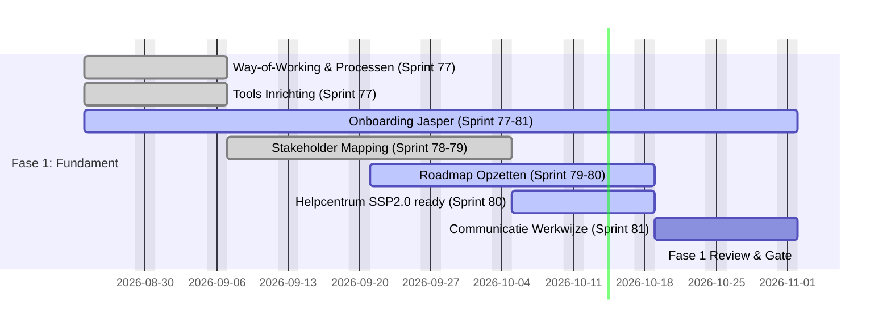

---
hide:
  - toc
---
# Enablement & Engagement Team - Roadmap 2026

*6-12 maanden planning voor het E&E Team van het Data Science Platform*

---

## Tijdlijn Overzicht - 2-wekelijkse Sprints

```mermaid
gantt
    title E&E Team Roadmap - Sprint-gebaseerd (2-weken cycli)
    dateFormat YYYY-MM-DD
    todayMarker stroke-width:3px,stroke:#0f0,opacity:0.5

    section Fase 1: Fundament
    Way-of-Working & Processen (Sprint 77)    :done,      p1_wow,    2026-08-24, 2026-09-07
    Tools Inrichting (Sprint 77)              :done,      p1_tools,  2026-08-24, 2026-09-07
    Onboarding Jasper (Sprint 77-81)          :active,    p1_onb,    2026-08-24, 2026-11-02
    Stakeholder Mapping (Sprint 78-79)        :done,      p1_stake,  2026-09-07, 2026-10-05
    Roadmap Opzetten (Sprint 79-80)           :active,    p1_road,   2026-09-21, 2026-10-19
    Helpcentrum SSP2.0 ready (Sprint 80)      :active,    p1_ssp,    2026-10-05, 2026-10-19
    Communicatie Templates & Beslisboom (Sprint 81)    :p1_comm,   2026-10-19, 2026-11-02
    Fase 1 - Afgerond                         :crit,      p1_gate,   2026-11-02, 2026-11-02

    section Fase 2: Efficiëntie

    section Fase 3: Enablement

    section Fase 4: Engagement

    section Fase 5: AI & Automatisering
```

---

## Fase 1: Fundament (Augustus - November 2026)

```mermaid
gantt
    dateFormat YYYY-MM-DD
    excludes    weekends
    weekend saturday
    todayMarker stroke-width:3px,stroke:#0f0,opacity:0.5

    section Fase 1: Fundament
    Way-of-Working & Processen (Sprint 77)    :done,      p1_wow,    2026-08-24, 2026-09-07
    Tools Inrichting (Sprint 77)              :done,      p1_tools,  2026-08-24, 2026-09-07
    Onboarding Jasper (Sprint 77-81)          :active,    p1_onb,    2026-08-24, 2026-11-02
    Stakeholder Mapping (Sprint 78-79)        :done,      p1_stake,  2026-09-07, 2026-10-05
    Roadmap Opzetten (Sprint 79-80)           :active,    p1_road,   2026-09-21, 2026-10-19
    Helpcentrum SSP2.0 ready (Sprint 80)      :active,    p1_ssp,    2026-10-05, 2026-10-19
    Communicatie Werkwijze (Sprint 81)        :p1_comm,   2026-10-19, 2026-11-02
    Fase 1 Review & Gate                      :crit,      p1_gate,   2026-11-02, 2026-11-02

```

**Doel:** Team gereed, stakeholders aligned, communicatie helder, roadmap vastgesteld

**Duur:** 5 sprints (10 weken)

### Sprint 77 (24 Aug - 7 Sep 2026) ✅ AFGEROND

| Taak | Verantwoordelijke | Output |
|------|------------------|--------|
| **Way-of-Working & Processen** | Team Lead (jij) | ✅ Gedocumenteerd: Besluitvorming, communicatie, sprint rhythm, escalatie proces, decision logs |
| **Team Rollen & Verantwoordelijkheden** | Team Lead (jij) | ✅ Duidelijke rollen per teamlid: wat je doet, wanneer je input hebt, wanneer je beslist |
| **Tools Inrichting** | Medior DevOps Engineer (begeleiding Team Lead) | ✅ Wiki ruimte opgezet, Jira project geconfigureerd (sprints, workflows, custom fields), Mattermost kanalen ingesteld |
| **Onboarding Jasper** | Team Lead (jij) + team | Jasper gestart op 1 september 2026: onboarding opgestart (kennismaking, toegang, introductie team & platform) |

**Status:** ✅ Afgerond

---

### Sprint 78 (7 Sep - 21 Sep 2026) ✅ AFGEROND

**Focus: Stakeholder Mapping**

| Taak | Verantwoordelijke | Output |
|------|------------------|--------|
| **Stakeholder Mapping & Alignment** | Team Lead (jij) | Overzicht van alle DSP stakeholders, contactpersonen, engagement plan, verwachtingen uitgelegd |
| **Onboarding Jasper** | Team Lead (jij) + team | Onboarding vervolgd |

**Deliverable:** Stakeholder matrix aangemaakt

---

### Sprint 79 (21 Sep - 5 Okt 2026) ✅ AFGEROND

**Focus: Stakeholder Mapping (Vervolg) & Roadmap Opzetten**

| Taak | Verantwoordelijke | Output |
|------|------------------|--------|
| **Stakeholder Mapping Verdieping** | Team Lead (jij) | Aanvullende gesprekken, alignment finaliseren |
| **Roadmap Opzetten** | Team Lead (jij) | Dit document uitgewerkt en in Wiki opgeslagen, met alle sprints, milestones, deliverables en afhankelijkheden |
| **Onboarding Jasper** | Team Lead (jij) + team | Onboarding vervolgd |

**Deliverable:** Stakeholder mapping goedgekeurd, eerste versie roadmap beschikbaar

**Milestone (5 Okt):** Stakeholder mapping afgerond

---

### Sprint 80 (5 Okt - 19 Okt 2026) 🔄 LOPEND

**Focus: Roadmap Opzetten (Vervolg) & Helpcentrum SSP2.0**

| Taak | Verantwoordelijke | Output |
|------|------------------|--------|
| **Roadmap Finalisering** | Team Lead (jij) | Roadmap final review, sign-off stakeholders |
| **Helpcentrum SSP2.0 ready** | Functioneel Beheer | Helpcentrum documentatie moet geupdate worden met SSP2.0 look-and-feel |
| **Onboarding Jasper** | Team Lead (jij) + team | Onboarding vervolgd |

**Deliverable:** Definitieve roadmap goedgekeurd, Helpcentrum SSP2.0 ready

**Milestone (19 Okt):** Roadmap ready for next phase

---

### Sprint 81 (19 Okt - 2 Nov 2026)

**Focus: Communicatie Templates & Beslisboom**

| Taak | Verantwoordelijke | Output |
|------|---|--------|
| **Communicatie Templates Ontwerpen** | Team Lead (jij) + Functioneel Beheerder | Templates voor support responses richting klanten (standaard issues, escalaties, follow-ups) |
| **Beslisboom Ontwikkelen** | Team Lead (jij) | Beslisboom voor wie communiceert als E&E team niet beschikbaar is (out-of-office protocol), escalatie paths |
| **Templates Testing** | Functioneel Beheerder | Doorloop scenarios: pas templates toe, feedback geven, optimalisaties |
| **Team Training Communicatie** | Team Lead (jij) | Training: wanneer welke template gebruiken? Personalisatie? Escalatie criteria? |
| **Templates & Beslisboom Live** | Team Lead (jij) | Opgeslagen in Wiki, toegankelijk voor het team, dagelijks bruikbaar |
| **Onboarding Jasper Afronden** | Team Lead (jij) + team | Onboarding afgerond aan het einde van Fase 1 |

**Deliverable:** Communicatie templates & beslisboom complete, team is op de hoogte en onboarding Jasper afgerond

**Milestone (2 Nov):** Fase 1 Gate - Fundament COMPLEET

---

## Fase 2: Efficiëntie (November 2026 - Januari 2027)

```mermaid
gantt
    dateFormat YYYY-MM-DD
    excludes    weekends
    todayMarker stroke-width:3px,stroke:#0f0,opacity:0.5

    section Fase 2: Efficiëntie
```

### Hoofdonderwerpen Fase 2

*Concept: onderwerpen en onderdelen worden later verder uitgewerkt tot planbare items.*

#### 1. Support Portaal optimalisatie

**Beschrijving:**

| Onderdeel | Beschrijving |
|-----------|--------------|
| JSM OT omgeving gelijk aan P | |
| Workflow inclusief resolution | |
| Automations | |
| Canned responses | |

#### 2. Inzichten voor support

**Beschrijving:**

| Onderdeel | Beschrijving |
|-----------|--------------|
| Jira Service Management Dashboarding | |
| Grafana Dashboarding | |
| Alerting | |

#### 3. Support ticket analyse

**Beschrijving:**

| Onderdeel | Beschrijving |
|-----------|--------------|
| Diensten met meeste verzoeken | |
| Veelvoorkomende vragen | |
| Doorlooptijden | |

#### 4. Voorbereiding Helpcentrum

**Beschrijving:**

| Onderdeel | Beschrijving |
|-----------|--------------|
| Strapi beschikbaar op OT | |
| Inzicht in mogelijkheden i.c.m. SSP | |
| Nieuwe opzet bepalen | |

**Doel:**

**Duur:**

---

## Fase 3: Enablement (Januari 2027 - Mei 2027)

```mermaid
gantt
    dateFormat YYYY-MM-DD
    excludes    weekends
    todayMarker stroke-width:3px,stroke:#0f0,opacity:0.5

    section Fase 3: Enablement
```

### Hoofdonderwerpen Fase 3

*Concept: onderwerpen en onderdelen worden later verder uitgewerkt tot planbare items.*

#### 1. Vernieuwen Helpcentrum

**Beschrijving:**

| Onderdeel | Beschrijving |
|-----------|--------------|
| | |

#### 2. Onboarding klanten

**Beschrijving:**

| Onderdeel | Beschrijving |
|-----------|--------------|
| | |

#### 3. Code Examples

**Beschrijving:**

| Onderdeel | Beschrijving |
|-----------|--------------|
| | |

**Doel:**

**Duur:**

---

## Fase 4: Engagement (Mei 2027 - November 2027)

```mermaid
gantt
    dateFormat YYYY-MM-DD
    excludes    weekends
    todayMarker stroke-width:3px,stroke:#0f0,opacity:0.5

    section Fase 4: Engagement
```

### Hoofdonderwerpen Fase 4

*Concept: onderwerpen en onderdelen worden later verder uitgewerkt tot planbare items.*

#### 1. Power-Users opzet

**Beschrijving:**

| Onderdeel | Beschrijving |
|-----------|--------------|
| | |

#### 2. Organisatie intrekken

**Beschrijving:**

| Onderdeel | Beschrijving |
|-----------|--------------|
| | |

#### 3. Events opzetten

**Beschrijving:**

| Onderdeel | Beschrijving |
|-----------|--------------|
| | |

#### 4. Blogs over projecten

**Beschrijving:**

| Onderdeel | Beschrijving |
|-----------|--------------|
| | |

**Doel:**

**Duur:**

---

## Fase 5: AI & Automatisering (November 2027 - April 2028)

```mermaid
gantt
    dateFormat YYYY-MM-DD
    excludes    weekends
    todayMarker stroke-width:3px,stroke:#0f0,opacity:0.5

    section Fase 5: AI & Automatisering
```

### Hoofdonderwerpen Fase 5

*Concept: onderwerpen en onderdelen worden later verder uitgewerkt tot planbare items.*

#### 1. 1e lijn Chatbot

**Beschrijving:**

| Onderdeel | Beschrijving |
|-----------|--------------|
| | |

#### 2. Support Portaal AI inzichten

**Beschrijving:**

| Onderdeel | Beschrijving |
|-----------|--------------|
| | |

#### 3. FAQ generator

**Beschrijving:**

| Onderdeel | Beschrijving |
|-----------|--------------|
| | |

#### 4. Missende documentatie analyse

**Beschrijving:**

| Onderdeel | Beschrijving |
|-----------|--------------|
| | |

#### 5. Documentatie generator

**Beschrijving:**

| Onderdeel | Beschrijving |
|-----------|--------------|
| | |

**Doel:**

**Duur:**

---
